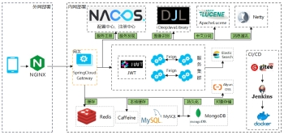
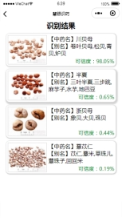
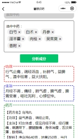
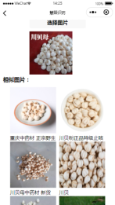
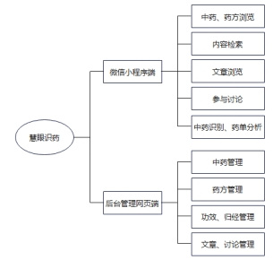
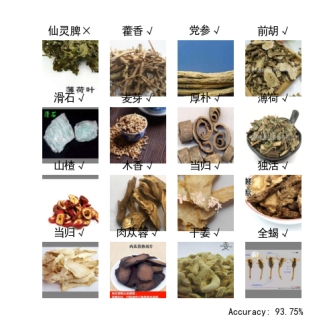
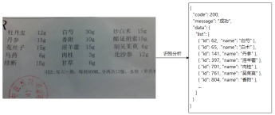
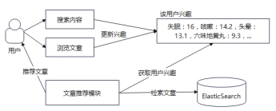

## 项目介绍

22年搞的大创用的项目，具体细节忘了，反正好像后面有些小细节懒得改了。管理员后台界面找不到了，懒得找了。

后端Springboot，前端微信小程序，实现中药图片识别、中药单分析主治功效等、相似图片检索。使用DJL在java端调用pytorch训练好的模型，对上传的图片进行识别，完成中药识别、特征提取（用于相似图片检索）。使用ElasticSearch实现全文检索和相似图片检索的向量检索，以及中药成分分析检索。

> 架构图

## 效果展示（原图找不到，word里复制出来的）

> 中药识别界面

> 药单分析界面

> 图片搜索界面

> 其他杂七杂八图片

## 注意事项

模型不想传了，自行训练吧，我中药识别用的efficientnet，可以换个轻量点的模型，比如mobilenet shufflenet ghostnet什么的。

提取特征我用的预训练的resnet吧。

文章关键词提取随便用ik分词器糊弄了一下，自定义关键词词典，然后提取文章中出现频率最高的x个词语。

文字识别用的百度OCR，自行申请API，免费。

**细节看我CSDN发的文章：**

[Java调用Pytorch模型进行图像识别](https://blog.csdn.net/m0_52640724/article/details/124565688?spm=1001.2014.3001.5502)

[Java+ElasticSearch+Pytorch实现以图搜图](https://blog.csdn.net/m0_52640724/article/details/129357847?spm=1001.2014.3001.5502)